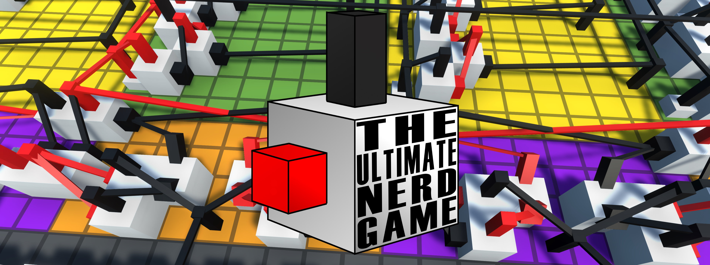

Builds of TUNG can be downloaded from the [Itch page](https://jimmycushnie.itch.io/tung).

## Introduction

The Ultimate Nerd Game, also known as TUNG, is a first-person digital logic sandbox game. I (Jimmy Cushnie) worked on it from October 2017 until late 2018. In that time, I released 13 public versions of the game, and it gained a small but enthusiastic following. Eventually my co-developer Felipe Martínez and I decided that the codebase was unsalvageably disastrous, and we started over almost from scratch. Our restarted codebase became [Logic World](https://logicworld.net), which at time of writing we are still working on.

TUNG served as a pathfinder for Logic World. It proved that this kind of game is fun and has an audience. In all its quirky, buggy, laggy glory, it was an important part of our journey to create the best circuit simulation game ever.

A number of TUNG fans have requested a release of TUNG's source code, for historical curiosity as well as to make modding easier. As embarrassed as I am by this code, I'm a big believer in open source, so here we are.

## Disclaimer: the code is very bad

TUNG was my first serious programming project, and I *did not* know what the hell I was doing. The code is extremely bad. I am deeply ashamed of it. I release this code with sincere apologies to the estate of Alan Turing and to God Himself. Do not take anything in here as an example of how you should do things; it's mostly an example of how *not* to do things.

## Credits

A huge thank you to my collaborators on TUNG, who all graciously agreed to this open source release of their work.

* Programming and Game Design by ya boi, Jimmy Cushnie (http://jimmycushnie.com/)
* Original sound effects by Emmanuel Lagumbay (https://www.lagumbayaudio.com/)
* The Ultimate Nerd Game logo by Daniel John
* Legacy Mouse Hat Games logo by Brooke Morgan (https://brookemorgan.ca/)
* Miscellaneous graphic design by Benjamin Longley (https://www.instagram.com/FragariaDesigns/)
* Special thanks to everyone who played TUNG. Y'all are The Ultimate Nerds <3

## Missing Assets

Unfortunately, a full release of the source is not possible, and some parts of the original source are omitted from this release. To properly load the project in Unity and produce a working build, you will need to acquire the following assets, or suitable replacements for them.

* [AQUAS](https://dogmaticgames.wordpress.com/products/aquas-water-shader-set/), a water shader used for the Secret Lake found within a mountain in one corner of the map.
  * AQUAS has a lite/free version that would probably work fine. Or you can have a pink lake.
* [Easy Save 3](https://moodkie.com/easysave/), used to save and load JSON data.
  * It should be very simple to write a replacement class that saves and loads data using Newtonsoft.JSON or some other data serialization library.
* [UGUI Kit: Flat](https://assetstore.unity.com/packages/2d/gui/icons/ugui-kit-flat-47724), used for various icons and UI templates.
  * If there are missing icons, you can get replacements from free sources like FontAwesome. Any missing UI templates should be fairly easy to recreate if you have a decent understanding of UGUI.
* [Wispy Skybox](https://assetstore.unity.com/packages/2d/textures-materials/sky/wispy-skybox-21737), the skybox used in the game world.
* [TextMeshPro](https://docs.unity3d.com/Manual/com.unity.textmeshpro.html), used for rendering all the text in the game.
  * You only need to acquire this for TUNG versions before 0.2.7.
  * Prior to Unity 2018, TextMeshPro was distributed through the Asset Store instead of the Package Manager. This is the version of TextMeshPro that TUNG used from 0.1 through 0.2.6. Unfortunately, Legacy TMP is not publicly available anymore, so you will have big problems if you try to build older versions of TUNG using their original 2017 Unity versions.
    If you want to build a pre-0.2.7 TUNG version, you will probably have to use a modern Unity version and install TMP using the Package Manager. If you do this, you'll need to [follow the upgrade process](https://forum.unity.com/threads/migrating-from-legacy-asset-store-to-package-manager-releases.511748/). This process has already been done for 0.2.7.

* [The old Unity Standard Assets](https://assetstore.unity.com/packages/essentials/asset-packs/standard-assets-for-unity-2018-4-32351), used for world art assets and for the first person controller code.
  * TUNG contains a lot of modifications to the Unity Standard First Person Controller, including support for flying, noclip mode, and custom footstep sounds dependent on the terrain texture at the character's location. Unfortunately, Unity's EULA does not permit me to redistribute the Standard Assets with or without modification. You will have to code in these features yourself, or live without them.

* [Thread Ninja](https://assetstore.unity.com/packages/tools/thread-ninja-multithread-coroutine-15717), used for making some code multithreaded.
  * You only need to acquire this for TUNG v0.2.0 and later
* Logic World and modern Mouse Hat Games logos, used in 0.2.7 for the new splash screen and main menu.
  * I figure it's probably best not to release these logos as open source, since we're actively using them for commercial purposes and they represent closed-source IP. Please feel welcomed to substitute these with your own terrible MS paint versions.

* All music
  * I have elected not to distribute the tracks from TUNG's soundtrack in this open source release. You can find a list of the pieces in the in-game credits or in `Assets/_original assets/Resources/readme.txt`. I've left the .meta files for the tracks intact, in `Assets/Sound/Music`, so it should be easy to swap the files in and have all the music code work properly.

## Redistributed Assets

There are various assets included in this release which were not created for TUNG, and are redistributed under their original licenses.

* [Cinemachine](https://github.com/Unity-Technologies/com.unity.cinemachine) under the Unity Companion Cinemachine Code License 1.0
* [Outline Effect](https://github.com/cakeslice/Outline-Effect) under the MIT license
* [NaughtyAttributes](https://github.com/dbrizov/NaughtyAttributes) under the MIT license
* [Unity Post-Processing v1](https://github.com/Unity-Technologies/PostProcessing/tree/v1) under the MIT license

* [Inconsolata](https://www.levien.com/type/myfonts/inconsolata.html) under the Open Font License
* Various unoriginal sound effects found in `Assets/Sounds`. These are all distributed under Creative Commons Zero, and there are text files in that directory with links to the source of these sounds.

## Contributions

We are not updating TUNG anymore, and we're focusing all our development effort on the far superior [Logic World](https://logicworld.net/). As such, pull requests and issues about bugs or features with the game itself will not be accepted to this repo. Issues regarding this readme and PRs to fix readme issues will be accepted however.

## Questions?

As mentioned, a lot of this code is bad and hard to understand. If you are trying to read and understand it, you will probably have a lot of questions about it. As the person who wrote the code, I (Jimmy) will be happy to answer those questions. Please feel free to ask them in the [discussions tab](https://github.com/MouseHatGames/The-Ultimate-Nerd-Game/discussions).

